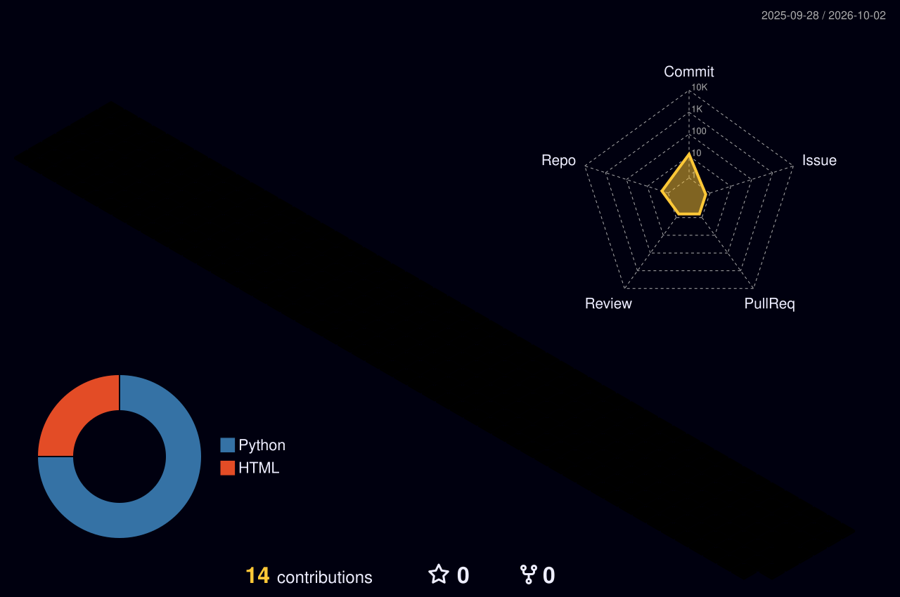

<!-- ═══════════════════════════ HEADER ═══════════════════════════ -->
<p align="center">
  
</p>

<p align="center">
  <a href="https://mrkuragan-sir.github.io">
    
  </a>
</p>

<p align="center">
  <a href="https://mrkuragan-sir.github.io"></a>
</p>

<p align="center">
  
  
  
</p>

<br/>

<!-- ═══════════════════════════ ABOUT ═══════════════════════════ -->
<h2 align="center">⚡ whoami</h2>

<table align="center">
<tr>
<td width="55%" valign="top">

```python
class Kuragan(Engineer):
    def __init__(self):
        self.name       = "Emirhan Sirma"
        self.education  = "B.Sc. Computer Engineering"
        self.university = "Atatürk University 🇹🇷"
        self.languages  = ["Turkish", "English"]

    @property
    def stack(self):
        return {
            "ai_ml":    ["YOLO", "OpenCV", "PyTorch"],
            "backend":  ["Python", "C/C++", "Java"],
            "mobile":   ["Flutter", "Kotlin"],
            "tooling":  ["Git", "Docker", "Claude Code"],
        }

    @property
    def currently(self):
        return [
            "🎯 Real-time air defense vision system",
            "🎬 Fully automated video pipeline",
            "📱 Cross-platform productivity apps",
        ]

    def philosophy(self):
        return "Automate the boring. Build the impossible."
```

</td>
<td width="45%" valign="top">

#### 🔭 Currently Working On
- 🎯 **Teknofest** — Air Defense System (HSS)
- 🎬 **AutoTube** — AI video automation pipeline
- 🏷️ **CV Annotation Tool** — free & unlimited

#### 🌱 Currently Learning
- Advanced object tracking & model optimization
- Cross-platform app architecture
- MLOps & deployment

#### 🧪 Outside of Code
- ⚛️ Theoretical physics (macro & micro)
- ∑ Mathematics
- 🧠 Psychology
- 🎮 PC gaming

#### 💬 Ask me about
`Computer Vision` `Python` `Automation`

</td>
</tr>
</table>

<br/>

<!-- ═══════════════════════════ PROJECTS ═══════════════════════════ -->
<h2 align="center">🚀 Projects</h2>

<!-- REPO YAYINLAYINCA: Bu yorumun altındaki <p> bloğunun yorumunu kaldır ve REPO_ADI kısmını değiştir.
<p align="center">
  <a href="https://github.com/mrkuragan-sir/REPO_ADI">
    
  </a>
</p>
-->

| | Project | What it does | Stack | Status |
|:-:|---|---|---|:-:|
| 🎯 | **Air Defense System** | Real-time target detection, tracking & lock-on for Teknofest | `Python` `YOLO` `OpenCV` |  |
| 🎬 | **AutoTube** | End-to-end automated Shorts & long-form video production | `Python` `LLM APIs` `FFmpeg` |  |
| 🏷️ | **CV Annotation Tool** | BBox/polygon labeling + augmentation, no limits, no paywall | `Python` `Computer Vision` |  |
| 📚 | **Study Planner** | Schedule, topics & resources with built-in AI assistant | `Flutter` `Gemini API` |  |
| 🎙️ | **Lecture → PDF** | Records Turkish lectures and turns them into clean documents | `Mobile` `Speech-to-Text` |  |

<br/>

<!-- ═══════════════════════════ TECH STACK ═══════════════════════════ -->
<h2 align="center">🛠️ Tech Arsenal</h2>

<p align="center">
  
</p>
<p align="center">
  
</p>
<p align="center">
  
</p>

<details>
<summary><b>🧩 Full breakdown</b></summary>
<br/>

| Category | Tools |
|---|---|
| **Languages** |       |
| **AI / Vision** |      |
| **Mobile** |    |
| **AI Tools** |   |
| **DevOps** |    |
| **Hardware** |   |

</details>

<br/>

<!-- ═══════════════════════════ STATS ═══════════════════════════ -->
<h2 align="center">📊 GitHub Analytics</h2>

<p align="center">
  
  
</p>

<p align="center">
  
</p>

<p align="center">
  
</p>

<p align="center">
  
</p>

<br/>

<!-- ═══════════════════════════ TROPHIES ═══════════════════════════ -->
<h2 align="center">🏆 Trophy Case</h2>

<p align="center">
  
</p>

<br/>

<!-- ═══════════════════════════ SNAKE ═══════════════════════════ -->
<p align="center">
  <picture>
    <source media="(prefers-color-scheme: dark)" srcset="https://raw.githubusercontent.com/mrkuragan-sir/mrkuragan-sir/output/github-snake-dark.svg" />
    <source media="(prefers-color-scheme: light)" srcset="https://raw.githubusercontent.com/mrkuragan-sir/mrkuragan-sir/output/github-snake.svg" />
    
  </picture>
</p>

<br/>

<!-- ═══════════════════════════ QUOTE ═══════════════════════════ -->
<p align="center">
  
</p>

<br/>

<!-- ═══════════════════════════ CONNECT ═══════════════════════════ -->
<h2 align="center">🤝 Let's Connect</h2>

<p align="center">
  <a href="https://mrkuragan-sir.github.io"></a>
  <a href="mailto:emirhansirma10@gmail.com"></a>
  <a href="https://www.linkedin.com/in/emirhan-sirma-bb478934a/"></a>
  <a href="https://www.youtube.com/@ifyouwant3225"></a>
  <a href="https://www.instagram.com/iamemirhan.exe/"></a>
</p>

<p align="center">
  
</p>

<!-- ═══════════════════════════ FOOTER ═══════════════════════════ -->
<p align="center">
  
</p>
